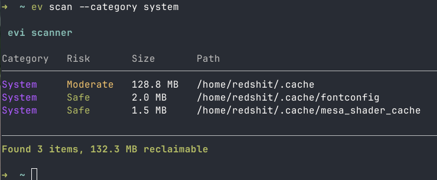
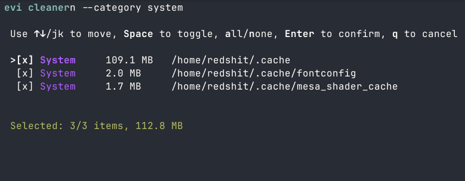
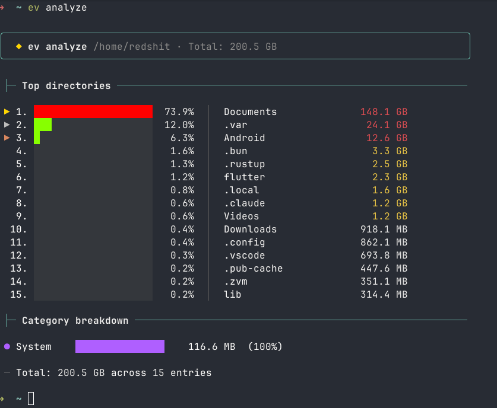
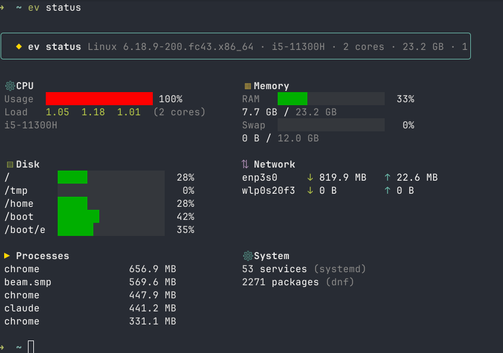

# ev

A filesystem cleaner and disk space analyzer for Linux and FreeBSD.

`ev` scans your system for reclaimable space: build artifacts, package caches, AI model caches, browser data. Then lets you clean up interactively or in bulk.

## Install

### Quick install

```
curl -fsSL https://raw.githubusercontent.com/ErickJ3/ev/main/install.sh | bash
```

Downloads the latest binary for your platform to `~/.local/bin`.

### Build from source

Requires [Zig](https://ziglang.org/) 0.16+.

```
zig build -Doptimize=ReleaseFast
```

The binary is at `zig-out/bin/ev`.

### Shell completions

Completion scripts are in the `completions/` directory:

**Bash**

```
mkdir -p ~/.local/share/bash-completion/completions
cp completions/ev.bash ~/.local/share/bash-completion/completions/ev
```

**Zsh**

```
mkdir -p ~/.local/share/zsh/site-functions
cp completions/ev.zsh ~/.local/share/zsh/site-functions/_ev
```

Make sure the directory is in your `fpath` before `compinit` runs (with Oh My Zsh, before `source $ZSH/oh-my-zsh.sh`). Add to `~/.zshrc`:

```
fpath=("$HOME/.local/share/zsh/site-functions" $fpath)
```

**Fish**

```
mkdir -p ~/.config/fish/completions
cp completions/ev.fish ~/.config/fish/completions/ev.fish
```

## Screenshots

### Scan


### Clean (interactive)


### Analyze


### Status


## Usage

### Scan for reclaimable space

```
ev scan
ev scan /home/user/projects
ev scan -c dev
```

### Clean interactively

```
ev clean              # interactive selection
ev clean --dry-run    # preview what would be deleted
ev clean --force      # delete without confirmation
ev clean --dev        # only dev artifacts
ev clean --ai         # only AI/ML caches
```

Category filters: `--dev`, `--system`, `--package`, `--ai`, `--browser`, or `-c <name>`.

### Purge build artifacts from projects

```
ev purge ~/projects
ev purge ~/projects --depth 5
ev purge ~/projects --dry-run
```

Walks a directory tree, finds projects by marker files (`package.json`, `Cargo.toml`, etc.), and cleans their build outputs.

### Analyze disk usage

```
ev analyze
ev analyze /home --depth 5 --top 20
```

### System status

```
ev status
```

### Configuration

```
ev config show
ev config whitelist ~/important-project
```

## Categories

| Category | Rules | Examples |
|----------|------:|---------|
| dev      |    24 | `node_modules`, `target/`, `.venv`, `__pycache__`, `zig-cache` |
| package  |    13 | npm, pip, cargo, pnpm, yarn, go module caches |
| system   |     7 | thumbnails, trash, journal logs, font cache |
| ai       |     6 | Hugging Face, Ollama, PyTorch, Keras, Conda |
| browser  |     4 | Chrome, Firefox, Chromium, Brave |

## Configuration

Whitelist — paths `ev` will never touch:

```
~/.config/evi/whitelist
```

One path per line. Lines starting with `#` are comments.

Operation log — records every deletion with timestamps:

```
~/.local/share/evi/operations.log
```

## Platforms

- Linux (x86_64, aarch64)
- FreeBSD (x86_64)
